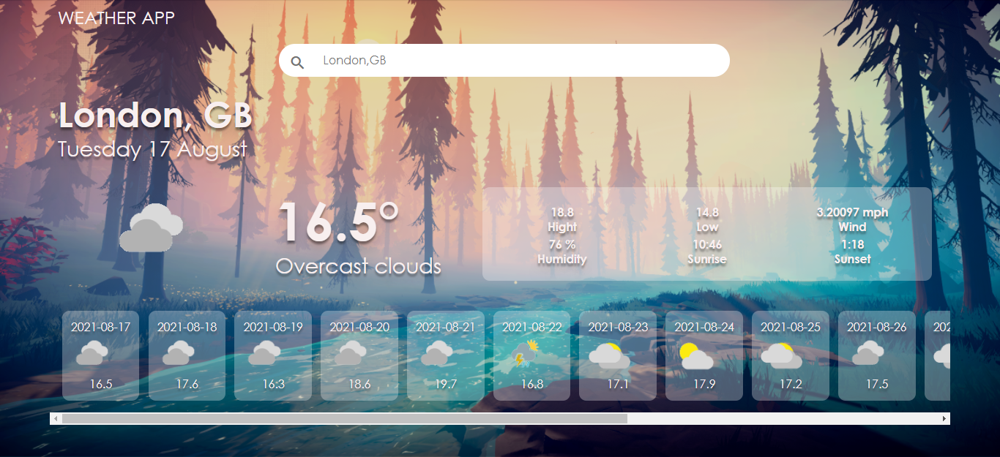
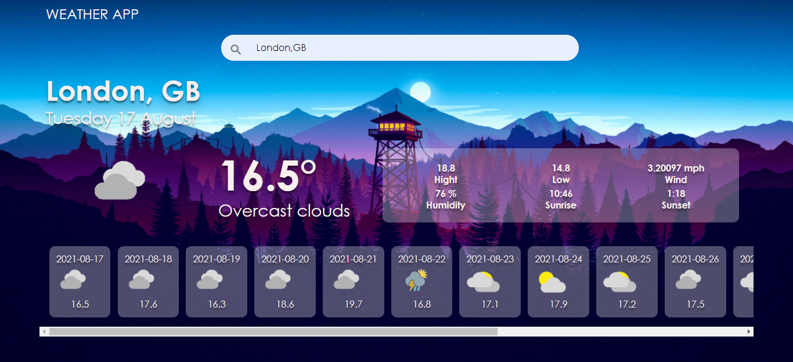

<h1>Weather application 🌦</h1>
A simple, pleasant to use application.
Uses <a href='https://www.weatherbit.io/api/weather-forecast-16-day'>the weather forecast API from weatherbit.io.for 16 days</a>.
The default location is your current location (I use the <a href='https://ipinfo.io/'>ipinfo.io
API</a> to determine it).  You can also search for weather in other cities.

<h3>Preview</h3>
<h5>Light theme (from 3 a.m. to 8 p.m.)</h5>

<h5>Dark theme (from 8 p.m. to 3 a.m.)</h5>

<h3>Built With</h3>
<ul>
    <li>Pug</li>
    <li>Less</li>
    <li>JavaScript</li>
    <li>Node.js</li>
</ul>

<h3>Getting Started</h3>

<h5>Setup</h5>

The project repository can be found in <a href='https://github.com/I-am-Craz/weather_app.git'>GitHub link</a> or just clone the project using this command.  

<code>
git clone https://github.com/I-am-Craz/weather_app.git
</code>

<h5>Install</h5>

Install <a href='https://www.npmjs.com/'>NPM</a> and <a href='https://nodejs.org/en/'>Node.js</a>

Check that you have Node.js and npm installed

To check if you have Node.js installed, run 
this command in your terminal:  
 
 <code> node -v </code>
 
 To confirm that you have npm installed you can run this command in your terminal:  
 
 <code>npm -v </code>
 
 Then you need to open in the terminal the folder where you cloned the project and run the following command:
 
 <code>
    npm start
 </code>
 
 And finally, you can open your browser and write the following in the query line: 
 
 <code>
 localhost:4000
 </code>
 
 